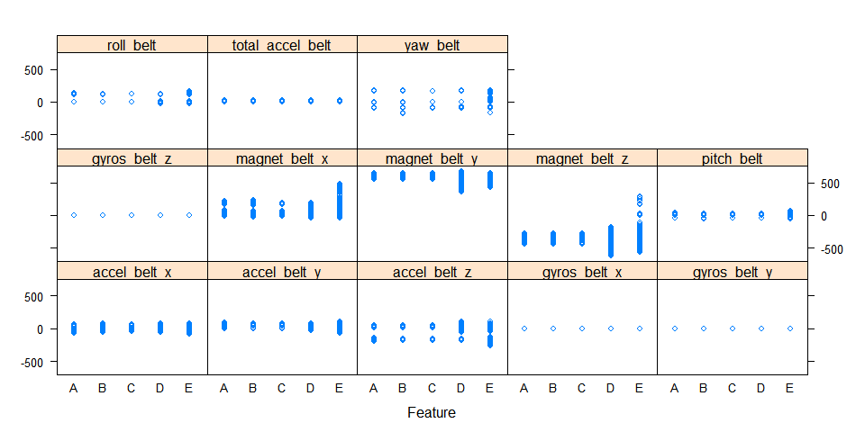

# Practical Machine Learning Project: Predict Exercise Performance Using Human Activity Recognition Data
J. T.  
April 2, 2016  


###Summary
This project is to use human activity recogtnition data collected by werable  accelerometers to predict the manner in which subjects did their exercises. Six participants performed barbell lifts correctly and incorrectly in 5 different ways (graded as A - F) with accelerometers placed on their belt, forearm, arm, and dumbell. More information is available from the [website](http://groupware.les.inf.puc-rio.br/har) (see the section on the Weight Lifting Exercise Dataset).

Two machine learning algorithm: Decision Tree and Random Forest, are used to fit the data. Random Foreset algorithm build the model with accuracy >99% in cross validation and successfully predict the test data.

###Loading and Cleaning-up Data
The training data available  [here](https://d396qusza40orc.cloudfront.net/predmachlearn/pml-training.csv) are used to develop and validate the machine learning algorithm. The test data available  [here](https://d396qusza40orc.cloudfront.net/predmachlearn/pml-testing.csv) have 20 cases, which are used to complete project quiz. The training data has 19622 observations and 160 columns. A lot of columns have high portions of NA's as the following example. Therefore, the numbers of NAs are calculated for all the columns and any columns with over 50% NAs are removed from the dataset.   


```
##  kurtosis_roll_belt kurtosis_picth_belt kurtosis_yaw_belt
##  Min.   :-2.121     Min.   :-2.190      Mode:logical     
##  1st Qu.:-1.329     1st Qu.:-1.107      NA's:19622       
##  Median :-0.899     Median :-0.151                       
##  Mean   :-0.220     Mean   : 4.334                       
##  3rd Qu.:-0.219     3rd Qu.: 3.178                       
##  Max.   :33.000     Max.   :58.000                       
##  NA's   :19226      NA's   :19248                        
##  skewness_roll_belt skewness_roll_belt.1 skewness_yaw_belt
##  Min.   :-5.745     Min.   :-7.616       Mode:logical     
##  1st Qu.:-0.444     1st Qu.:-1.114       NA's:19622       
##  Median : 0.000     Median :-0.068                        
##  Mean   :-0.026     Mean   :-0.296                        
##  3rd Qu.: 0.417     3rd Qu.: 0.661                        
##  Max.   : 3.595     Max.   : 7.348                        
##  NA's   :19225      NA's   :19248
```

Sixty columns with less than 50% NAs are listed in the following table. As shown in the table, the first seven columns are not related to the activity measurements so also removed from the dataset. The dataset actually used for developing machine learning algorithm has 53 variables including the response variable "classe" and 52 features.

```
##  [1] "X"                    "user_name"            "raw_timestamp_part_1"
##  [4] "raw_timestamp_part_2" "cvtd_timestamp"       "new_window"          
##  [7] "num_window"           "roll_belt"            "pitch_belt"          
## [10] "yaw_belt"             "total_accel_belt"     "gyros_belt_x"        
## [13] "gyros_belt_y"         "gyros_belt_z"         "accel_belt_x"        
## [16] "accel_belt_y"         "accel_belt_z"         "magnet_belt_x"       
## [19] "magnet_belt_y"        "magnet_belt_z"        "roll_arm"            
## [22] "pitch_arm"            "yaw_arm"              "total_accel_arm"     
## [25] "gyros_arm_x"          "gyros_arm_y"          "gyros_arm_z"         
## [28] "accel_arm_x"          "accel_arm_y"          "accel_arm_z"         
## [31] "magnet_arm_x"         "magnet_arm_y"         "magnet_arm_z"        
## [34] "roll_dumbbell"        "pitch_dumbbell"       "yaw_dumbbell"        
## [37] "total_accel_dumbbell" "gyros_dumbbell_x"     "gyros_dumbbell_y"    
## [40] "gyros_dumbbell_z"     "accel_dumbbell_x"     "accel_dumbbell_y"    
## [43] "accel_dumbbell_z"     "magnet_dumbbell_x"    "magnet_dumbbell_y"   
## [46] "magnet_dumbbell_z"    "roll_forearm"         "pitch_forearm"       
## [49] "yaw_forearm"          "total_accel_forearm"  "gyros_forearm_x"     
## [52] "gyros_forearm_y"      "gyros_forearm_z"      "accel_forearm_x"     
## [55] "accel_forearm_y"      "accel_forearm_z"      "magnet_forearm_x"    
## [58] "magnet_forearm_y"     "magnet_forearm_z"     "classe"
```

###Developing Algorithm

####Preparing Data


The data are splitted into my training data (60% of the processed training data, 11776 observations) for building models and my testing data(40% of the processed training data, 7846 observations) for cross validation. The variables are checked for "zero variance". As the following results showed, all the variables have variance larger than 0. 


```
##                      freqRatio percentUnique zeroVar   nzv
## roll_belt             1.074681     8.4408967   FALSE FALSE
## pitch_belt            1.132743    13.6039402   FALSE FALSE
## yaw_belt              1.110727    14.4616168   FALSE FALSE
## total_accel_belt      1.070275     0.2377717   FALSE FALSE
## gyros_belt_x          1.071693     1.0275136   FALSE FALSE
## gyros_belt_y          1.123699     0.5434783   FALSE FALSE
## gyros_belt_z          1.043636     1.3417120   FALSE FALSE
## accel_belt_x          1.101322     1.3077446   FALSE FALSE
## accel_belt_y          1.113269     1.1124321   FALSE FALSE
## accel_belt_z          1.082721     2.4201766   FALSE FALSE
## magnet_belt_x         1.030435     2.5220788   FALSE FALSE
## magnet_belt_y         1.051471     2.3947011   FALSE FALSE
## magnet_belt_z         1.003460     3.5495924   FALSE FALSE
## roll_arm             53.648649    19.4378397   FALSE FALSE
## pitch_arm            79.440000    22.3675272   FALSE FALSE
## yaw_arm              29.191176    21.5268342   FALSE FALSE
## total_accel_arm       1.041509     0.5519701   FALSE FALSE
## gyros_arm_x           1.016077     5.2904212   FALSE FALSE
## gyros_arm_y           1.511628     3.0400815   FALSE FALSE
## gyros_arm_z           1.231579     1.8936821   FALSE FALSE
## accel_arm_x           1.019608     6.4453125   FALSE FALSE
## accel_arm_y           1.101562     4.4667120   FALSE FALSE
## accel_arm_z           1.050000     6.4028533   FALSE FALSE
## magnet_arm_x          1.037037    11.1413043   FALSE FALSE
## magnet_arm_y          1.018182     7.2095788   FALSE FALSE
## magnet_arm_z          1.126984    10.5044158   FALSE FALSE
## roll_dumbbell         1.063291    87.4235734   FALSE FALSE
## pitch_dumbbell        2.357143    85.1817255   FALSE FALSE
## yaw_dumbbell          1.076923    86.7017663   FALSE FALSE
## total_accel_dumbbell  1.045077     0.3566576   FALSE FALSE
## gyros_dumbbell_x      1.054945     2.0040761   FALSE FALSE
## gyros_dumbbell_y      1.150000     2.2758152   FALSE FALSE
## gyros_dumbbell_z      1.025210     1.6219429   FALSE FALSE
## accel_dumbbell_x      1.015152     3.3882473   FALSE FALSE
## accel_dumbbell_y      1.177305     3.8298234   FALSE FALSE
## accel_dumbbell_z      1.092715     3.3372962   FALSE FALSE
## magnet_dumbbell_x     1.084906     8.7890625   FALSE FALSE
## magnet_dumbbell_y     1.229358     6.9802989   FALSE FALSE
## magnet_dumbbell_z     1.114035     5.5536685   FALSE FALSE
## roll_forearm         12.449198    14.9456522   FALSE FALSE
## pitch_forearm        70.515152    21.0767663   FALSE FALSE
## yaw_forearm          15.938356    14.2917799   FALSE FALSE
## total_accel_forearm   1.187158     0.5689538   FALSE FALSE
## gyros_forearm_x       1.063492     2.4031929   FALSE FALSE
## gyros_forearm_y       1.057522     6.0207201   FALSE FALSE
## gyros_forearm_z       1.116197     2.4031929   FALSE FALSE
## accel_forearm_x       1.192308     6.4962636   FALSE FALSE
## accel_forearm_y       1.048387     8.1691576   FALSE FALSE
## accel_forearm_z       1.032258     4.6535326   FALSE FALSE
## magnet_forearm_x      1.078431    12.0923913   FALSE FALSE
## magnet_forearm_y      1.160000    15.3617527   FALSE FALSE
## magnet_forearm_z      1.000000    13.3406929   FALSE FALSE
```

The features plots grouped by the locations of accelerometers show that different variables have quite different ranges. Since Decision Tree and Random Forest alogrithms are going to be applied in this project, standardizing data is not necessary. 

* Belt


* Arm


* Dumbell


* Forearm


####Decision Tree Algorithm

Decision Tree is firstly applied to train my training data. The final model of this algorithm is used to fit my testing data and the resutls are:  

```
## Confusion Matrix and Statistics
## 
##           Reference
## Prediction    A    B    C    D    E
##          A 2029  638  644  567  209
##          B   44  505   49  232  211
##          C  155  375  675  487  383
##          D    0    0    0    0    0
##          E    4    0    0    0  639
## 
## Overall Statistics
##                                           
##                Accuracy : 0.4904          
##                  95% CI : (0.4793, 0.5016)
##     No Information Rate : 0.2845          
##     P-Value [Acc > NIR] : < 2.2e-16       
##                                           
##                   Kappa : 0.3339          
##  Mcnemar's Test P-Value : NA              
## 
## Statistics by Class:
## 
##                      Class: A Class: B Class: C Class: D Class: E
## Sensitivity            0.9091  0.33267  0.49342   0.0000  0.44313
## Specificity            0.6334  0.91530  0.78388   1.0000  0.99938
## Pos Pred Value         0.4965  0.48511  0.32530      NaN  0.99378
## Neg Pred Value         0.9460  0.85114  0.87992   0.8361  0.88852
## Prevalence             0.2845  0.19347  0.17436   0.1639  0.18379
## Detection Rate         0.2586  0.06436  0.08603   0.0000  0.08144
## Detection Prevalence   0.5209  0.13268  0.26447   0.0000  0.08195
## Balanced Accuracy      0.7712  0.62399  0.63865   0.5000  0.72125
```

The accuracy is only 0.49.


####Random Forest Algorithm


Random Forest is then used to train the data. The final model of this algorithm is to fit my testing data and the results are:

```
## Loading required package: randomForest
```

```
## Warning: package 'randomForest' was built under R version 3.2.4
```

```
## randomForest 4.6-12
```

```
## Type rfNews() to see new features/changes/bug fixes.
```

```
## 
## Attaching package: 'randomForest'
```

```
## The following object is masked from 'package:ggplot2':
## 
##     margin
```

```
## The following object is masked from 'package:dplyr':
## 
##     combine
```

```
## Confusion Matrix and Statistics
## 
##           Reference
## Prediction    A    B    C    D    E
##          A 2232   15    0    0    0
##          B    0 1501   12    0    0
##          C    0    2 1352   30    3
##          D    0    0    4 1254    3
##          E    0    0    0    2 1436
## 
## Overall Statistics
##                                           
##                Accuracy : 0.991           
##                  95% CI : (0.9886, 0.9929)
##     No Information Rate : 0.2845          
##     P-Value [Acc > NIR] : < 2.2e-16       
##                                           
##                   Kappa : 0.9886          
##  Mcnemar's Test P-Value : NA              
## 
## Statistics by Class:
## 
##                      Class: A Class: B Class: C Class: D Class: E
## Sensitivity            1.0000   0.9888   0.9883   0.9751   0.9958
## Specificity            0.9973   0.9981   0.9946   0.9989   0.9997
## Pos Pred Value         0.9933   0.9921   0.9748   0.9944   0.9986
## Neg Pred Value         1.0000   0.9973   0.9975   0.9951   0.9991
## Prevalence             0.2845   0.1935   0.1744   0.1639   0.1838
## Detection Rate         0.2845   0.1913   0.1723   0.1598   0.1830
## Detection Prevalence   0.2864   0.1928   0.1768   0.1607   0.1833
## Balanced Accuracy      0.9987   0.9935   0.9915   0.9870   0.9978
```

The final model is validated in my testing data with accuracy 0.991. Out-of-sample error is less than 1%, which is very low. This model is accepted.

###Predict Test Data
The validated final model is used to predict "classe"" of the test data and the results are:

```
##  [1] B A B A A E D B A A B C B A E E A B B B
## Levels: A B C D E
```

The results are all correct according to the grade of project quiz. Therefore, the final model is successful.
